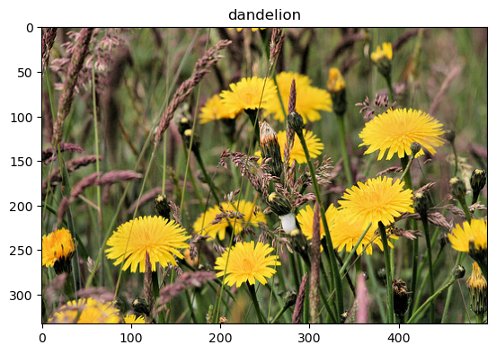
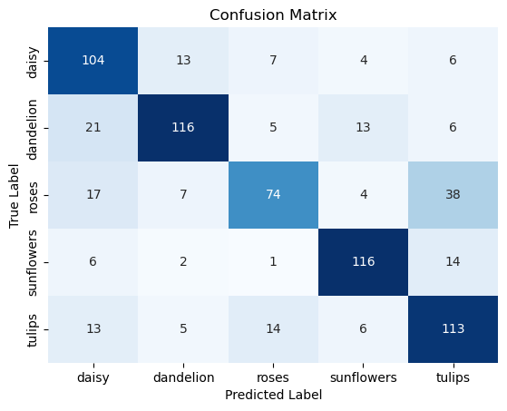

# Mastering Image Classification: A Beginner's Guide to Computer Vision

Tutorial created by Rebecca Borski

## 1. Goal/Objective

This tutorial is made for anyone who has a bit of experience with Python and wants to learn more about Artificial Intelligence (AI). This tutorial will dive deeper into the field of Computer Vision, focusing on Image Classification. The aim is to show you how to create an Image Classification algorithm, starting from finding good data, through building your first model, to evaluating the predictions. 

### What will you learn? (and what not)

You will learn about each step of the process of Image Classification. The tutorial will help you understand each step by providing detailed explanations and further information on each topic. 
If you are looking for a tutorial with a lot of explanation so you can understand every step, then this tutorial is for you! 

If you are expecting a lot of code and less explanation of what the code does, then this is not for you. I recommend you check out [the code documentation](https://www.tensorflow.org/tutorials/images/classification) then!

### Roadmap

Here is an overview of what you will learn: 


## 2. What is Computer Vision

Computer Vision is the field of Computer Science and AI that focuses on enabling computers to understand and interpret information from images and videos.

Key components of Computer Vision include:

- **Image Classification**
categorises images into predefined classes.

    This is typically done using Machine Learning algorithms, such as Convolutional Neural Networks (CNNs), which have proven highly effective for Image Classification tasks. You will learn more about how to build a CNN model later in this tutorial.

- **Object Detection and Recognition**
can locate and identify specific objects in an image or video.

    This often involves techniques such as sliding window approaches, region-based methods like R-CNN (Region-based Convolutional Neural Network), or more modern approaches like YOLO (You Only Look Once).

- **Image Segmentation** partitions an image into multiple segments or regions that represent a distinct object.


### What is Image Classification used for?

Image Classification is used to categorize images into predefined categories. Those categories can be different types of animals, cars, or even plants with various diseases. In Computer Vision, you call those categories "classes".

Image Classification has many real-world applications. For example, Medical Diagnosis, Crop Monitoring and Disease Detection. 

- **Medical Diagnosis:**
Image Classification is widely used in the field of medicine for tasks such as diagnosing diseases from medical images like X-rays, MRIs, or CT scans. For example, when diagnosing cancer, an Image Classification algorithm can help to detect tumours and classify them as benign or malignant. These systems are used to assist radiologists and pathologists in making accurate and timely diagnoses.[^1]

[^1]: Yadav, S.S., Jadhav, S.M. Deep convolutional neural network based medical Image Classification for disease diagnosis. J Big Data 6, 113 (2019). https://doi.org/10.1186/s40537-019-0276-2

- **Crop Monitoring and Disease Detection** 
Image Classification can be used in agriculture to monitor crops and detect diseases. Drones equipped with cameras fly over farmland, capturing images of crops from above. These images are then analyzed using Image Classification algorithms to identify various features such as crop health, growth stages, and the presence of diseases or pests.[^2]

[^2]: Ngugi, H.N., Ezugwu, A.E., Akinyelu, A.A. et al. Revolutionizing crop disease detection with computational deep learning: a comprehensive review. Environ Monit Assess 196, 302 (2024). https://doi.org/10.1007/s10661-024-12454-z


### What are the limits of Image Classification?
While Image Classification is a powerful technology, it has its limitations. 

Firstly, it heavily relies on the quality and quantity of training data, which means it may struggle with rare or novel classes not adequately represented in the training set. Secondly, Image Classification models may struggle with images containing complex or ambiguous scenes where objects are occluded, partially visible, or have similar visual appearances, leading to misclassifications or uncertainties. Additionally, Image Classification may not capture contextual information or temporal changes in images, limiting its ability to understand dynamic scenarios or make predictions beyond the current frame.


### Prerequisite for Image Classification: TensorFlow and Matplotlib

**TensorFlow** is an open-source library for Machine Learning and AI that you can use for free. It is used in all areas of Machine Learning and AI. For this tutorial you will be using it to preprocess data, train an Image Classification algorithm and evaluate the performance.

You can install TensorFlow using the terminal:

```cmd
pip install tensorflow
```

**Matplotlib** is an open-source library for data visualization in Python. With Matplotlib, you can create charts, plots, and figures to explore and communicate your data. In this tutorial, you will use it to visualize your datasets and analyze your model performance using line charts.

You can install Matplotlib using the terminal:

```cmd
pip install matplotlib 
```

## 3. Finding the right data

### Where can I find good data?

There are various places on the internet to find labelled images for Image Classification. But which one is the best and where should you start searching?

**Here are two great places to search for the right dataset:**

**[Kaggle datasets](<https://www.kaggle.com/datasets>)**

Kaggle is a great place to find various types of datasets including datasets for Image Classification. You can filter the datasets by “Computer Vision” to find one that you like. The datasets are free and use open-source licenses for further use. You can simply download them and use them in your project. As the datasets can be uploaded by Kaggle users, not all of them are of good quality. Make sure that you check the quality of the dataset thoroughly before using it.

**[TensorFlow datasets](<https://www.tensorflow.org/datasets>)**

TensorFlow, a Machine Learning library, also provides various big datasets for all kinds of Machine Learning tasks, including Image Classification. The datasets are curated and prepared by TensorFlow and usually originate from research projects or universities. Therefore the quality of the datasets is pretty good. The datasets are provided under open-source licenses and are free to use. The advantage of using TensorFlow datasets: You don’t have to download the dataset to your drive, TensorFlow does it for you.

### Things to consider when searching for a dataset

#### How complicated should it be?
  
- Opting for a medical dataset with for example chest X-rays might not be the best idea if you just want to learn how Image Classification works.
Instead, choose a dataset with distinct classes such as cats and dogs.

#### How many classes should I choose?

- Many datasets provide hundreds of classes to train your model on. The more images and classes your model is trained on, the harder your CPU/GPU has to work. Think about creating a subset of the dataset by choosing only a few classes.

- I suggest choosing a maximum of 20 classes to make sure that your computer can train a good model.

#### How many images should each class have?

- Make sure that each class has at least 50 images, otherwise, your model might not perform well.
- It's also important that all classes have around the same number of images, otherwise, the model will not train each class equally.

## Data Quality Checklist

Make sure your dataset fulfils the following criteria if you want a well-performing model:

- [x] There are at least 50 images per class
- [x] All classes have equal amounts of images
- [x] The images in each class are unique
- [x] The images in each class show different variations of the class

If you downloaded a dataset that doesn't fulfil the criteria, I suggest you adjust the dataset to check at least 3 out of 4 boxes.  

## 4. Load the data

For this tutorial I chose the [tf_flowers dataset](https://www.tensorflow.org/datasets/catalog/tf_flowers) from TensorFlow. It is perfect for beginners. You can choose any dataset that you want to follow in this tutorial.

You can download a dataset to your computer and then load the data from the directory. When using a dataset from TensorFlow, you can use tensorflow_datasets to load the data directly to your device.

Which approach you choose is totally up to you.
If you found a dataset on, for example, Kaggle and downloaded it to your computer, then follow the "Load data from directory" path. If you decided to use one of the TensorFlow datasets or you simply want to follow the tutorial using the tf_flowers dataset, then follow the "Load data from TensorFlow datasets" path.

### Load data from directory

---

The most important thing to check before loading the data is the structure of the directory.

For the classes to be loaded correctly, the library Keras needs each class in a separate folder. Like this:


As Keras is automatically downloaded with TensorFlow, you don't need to install the library separately.

```python
import tensorflow as tf

# Define the directory containing your dataset
train_dir = "/path/to/your/train/directory"
```

Before splitting the data, it's important to define the batch size with which the images should be loaded.

```python
batch_size = 32 # standard batch size
```

**Batch size**
is the number of training images used in one iteration. If you have 1000 training examples and you set the batch size to 100, it means that the model will see 100 examples at a time before updating its parameters.

Now you can use the the tensorflow.keras function to load the dataset from the directory:

```python
# Load training and validation datasets from a directory using the given parameters
train_dataset, validation_dataset = tf.keras.utils.image_dataset_from_directory(
    train_dir,
    validation_split=0.2,
    subset="both",
    seed=3,
    batch_size=batch_size,
    color_mode="rgb",
)
```

To evaluate the model performance reliably, you need a dataset with images that the model wasn't trained on. This dataset is called the "test dataset" because you can test the models' performance on data that is unknown to the model.

Unfortunately, most datasets don't come with a separate test dataset, so you have to use some images from the training dataset and move them to a new directory. The directory should have the same folder structure and can include as many images as you want to use to evaluate the model performance. Ideally, you want to use 10% of the training dataset as your test dataset.

```python
# Define the path to the test dataset directory
test_data_dir = '/path/to/your/test/directory'

# Load the test dataset
test_dataset = tf.keras.preprocessing.image_dataset_from_directory(
    test_data_dir,
    batch_size=batch_size,
    shuffle=False,  # No need to shuffle test data
    seed=123,
)
```

#### Extracting the classes

For training the model it is important to extract the number of classes your model has and store them in a new variable.
This is how you can do it:

```python
num_classes = len(train_dataset.class_names)

```

#### Visualize the dataset

To see if the data is loaded correctly, you can use the library Matplotlib to plot an image from the dataset. 
To do so, you can use a for-loop that iterates over the dataset to extract the image and its corresponding label for the index that you choose.

```python
import matplotlib.pyplot as plt

index = 42  # Index of the image-label pair you want to extract

# Iterate over the train dataset to get a batch of images
for images, labels in train_dataset.take(1):  
    
    image = images[index] # Get the image corresponding to the specified index
    label = labels[index].numpy() # Get the label corresponding to the specified index
    
    plt.imshow(image.numpy().astype("uint8")) # plot the image and its label
    plt.title(class_names[label])
```

Ouput:



### Load data from TensorFlow datasets

---

First, you have to install the TensorFlow dataset library to your environment. You can install the library in your terminal using the following prompt:

```cmd
pip install tensorflow_datasets
```

Now that the library is installed you can import it to your script and use the *tfds.load()* function just as shown in the [TensorFlow loading data tutorial](https://www.tensorflow.org/tutorials/load_data/images).

```python
import tensorflow_datasets as tfds

(train_dataset, test_dataset, validation_dataset), metadata = tfds.load(
    'tf_flowers', #change the name to your dataset
    split=['train[:80%]', 'train[80%:90%]', 'train[90%:]'],
    with_info=True,
    as_supervised=True,
    shuffle_files=True
)
```

This code downloads the dataset to your device and automatically seperates it into train, test, and validation splits. Besides the images, the metadata is also loaded so you can use the labels to train the model.

#### Extracting the labels

The metadata stores the information for each of the images, including the labels. To extract the labels from the metadata you can access the label variable from the features dictionary and store the class names in a list.

```python
class_names = metadata.features['label'].names
```

For the model training it is important to extract the number of classes your model has and store them in a new variable.
This is how you can do it:

```python

num_classes = metadata.features['label'].num_classes
```

#### Visualize the dataset

To show a specific image from the dataset, you can convert the dataset into a list which enables us to use the index to extract the information for the specific image.

*Tip: If you want to show more images from the dataset, you can use a for-loop to iterate over the entire dataset.*

```python
index = 42  # Index of the image-label pair you want to extract
train_list = list(train_dataset) 
image, label = train_list[index]

```

Now that you loaded the image and its corresponding label, you can use Matplotlib to show the image.

```python
import matplotlib.pyplot as plt

# plot the extracted image and its label
plt.imshow(image)
plt.title(class_names[label])
```

Ouput:


## 5. Preprocess the data

Preprocessing is an important step before starting the model training. Typical image preprocessing includes: resizing, data augmentation and normalization. Normalisation is usually included in the model architecture so you are not applying it beforehand.

**Why resize the images?**

- Ensures uniformity
- Improves computational efficiency
- Mitigates memory constraints
- Meets pretrained model requirements
- Normalizes pixel values
- Reduces overfitting

**Why apply data augmentation?**

- Improves the generalization and robustness of the Image Classification model
- Introduces variations in the training data

**Why use normalization?**

- Stabilizes training by ensuring smooth weight updates
- Promotes faster convergence during training
- Enhances numerical stability, preventing overflow or underflow issues
- Facilitates effective comparison of images by ensuring comparable scales
- Increases model robustness to variations in input data distribution

First, you can write the function with all preprocessing steps that you want to include:

```python
def preprocess_image(image, label):
    # Resize images to desired dimensions
    image = tf.image.resize(image, (img_height, img_width))
    # Add more augmentation techniques as needed
    image = tf.image.random_flip_left_right(image)
    return image, label
```

### A little note on data augmentation

For now you are only flipping the images from left to right as a data augmentation step. There are various other steps that you can use to increase the number of images your model is trained on. Here are some others you can apply:

**Random Rotation:** Rotate the image by a random angle within a specified range to simulate different viewpoints.

```python
# Random rotation between -20 and 20 degrees
image = tf.image.random_rotation(image, 20)
```

**Random Zoom:** Apply random zooming to the image to simulate different scales.

```python
# Random zoom between 0.7 and 1.3
image = tf.image.random_zoom(image, (0.7, 1.3))
```

**Random Brightness and Contrast:** Adjust the brightness and contrast of the image randomly.

```python
# Random brightness adjustment
image = tf.image.random_brightness(image, max_delta=0.3)

# Random contrast adjustment
image = tf.image.random_contrast(image, lower=0.5, upper=1.5)
```

Of course theres many more augmentations to use. To find the full documentation check out the [TensorFlow Documentation: Data Augmentation](https://www.tensorflow.org/tutorials/images/data_augmentation)

If you want to learn more about data augmentation I highly recommend the [Complete guide to data augmentation](https://www.datacamp.com/tutorial/complete-guide-data-augmentation) from DataCamp.

### Applying the preprocessing

To apply the data augmentation you can use the .map() function to map the preprocessing steps to the entire dataset.

Make sure to define the image height and width before mapping the preprocessing to the datasets.

```python
img_height = 128
img_width = 128
```

*Note: What image height and width you choose depends on the power of your computer. The bigger the images, the more computing power your computer needs.*

You only need to apply the preprocessing to the train and validation datasets.

```python
# Apply preprocessing to datasets
train_dataset = train_dataset.map(preprocess_image)
validation_dataset = validation_dataset.map(preprocess_image)
```

The test dataset doesn't need data augmentation as you will only use it to evaluate the performance of the model. You can simply resize the test dataset to ensure its compatibility with the trained model.

```python
# Resize the images in the test dataset
test_dataset = test_dataset.map(lambda image, label: (tf.image.resize(image, (img_height, img_width)), label))

```

Now your data is ready for training!

### Extra step for TensorFlow datasets

Did you use a dataset from TensorFlow datasets? If yes, there's one more step to do before you can move on to building the model.
If you downloaded and prepared your own dataset, you can move on to the next chapter!

Before training your model, you have to batch your datasets for the model to be able to train on them. When loading images from a directory, the batching is done while loading the dataset. When using TensorFlow datasets to load the data, the batching is done in a separate step.
You do that by defining a batch size and applying it to the datasets using the .batch() function.

```python
batch_size = 32 # standard batch size

# Batch the datasets
train_dataset = train_dataset.batch(batch_size)
test_dataset = test_dataset.batch(batch_size)
validation_dataset = validation_dataset.batch(batch_size)
```

**Batch size**
is the number of training images used in one iteration. If you have 1000 training examples and you set the batch size to 100, it means that the model will see 100 examples at a time before updating its parameters.

Now that your images are batched, you can move on to the next step!

## 6. Building your first model

### A classic CNN architecture

Before defining the model architecture, it is important to understand how the model works and what each layer does. This will also help you decide how to improve the model in a later step. 

First, you need to understand, what a Convolutional Neural Network is. 

A Convolutional Neural Network (CNN) is a type of deep learning model specifically designed for processing structured grid data, such as images. It is inspired by the human visual cortex and is designed to automatically learn hierarchical patterns and features from input images, making it highly effective in tasks like image classification, object detection, and recognition.

A CNN consists of multiple layers of convolutional and pooling operations followed by fully connected layers for classification. 

#### The CNN layers explained:

**Normalization layer** rescales the pixel values to the range [0-1] which helps stabilize the training process by ensuring that input features are within a similar scale.

**Convolutional layers** are responsible for extracting features from the input images. In the first convolutional layers, the CNN captures local patterns or features from small regions of the input images such as edges, corners, and textures. As the input data passes through more convolutional layers, the CNN learns to extract increasingly abstract and complex features. In this tutorial, you are using three sets of convolutional layers with increasing depth (16, 32, and 64 filters) to capture both low-level details and high-level semantic information. 

**Rectified linear unit (ReLU)** is used inside the convolutional layers to allow for faster and more effective training. ReLU maps the negative values to zero and maintains the positive values which enables the model to capture non-linear mappings between input and output. Only the activated features are carried forward into the next layer which can help in reducing computational complexity and overfitting by encouraging the CNN to learn more efficient representations.

**Max Pooling layers** simplify the output by performing nonlinear downsampling by dividing the input feature maps into non-overlapping rectangular regions (windows) and selecting the maximum value within each window. This helps in reducing computational complexity and extracting the most important features that CNN needs to learn.

These operations are repeated across many layers, each learning to identify different features. After these operations are done, the model moves to the classification layers.

**Flatten layer** flattens the output from the convolutional layers into a 1D vector, preparing it for input into the fully connected layers for classification.

**Dense Layer (128 neurons, ReLU activation)** consists of 128 neurons, each connected to every neuron in the previous layer. Dense layers aggregate and transform the features extracted by preceding layers into a high-dimensional representation. This transformation helps to abstract the input data into a form that is more suitable for making predictions or classifications.

**Output Layer** contains neurons equal to the number of classes in your dataset. Each neuron represents the probability of a corresponding class. The Softmax activation function converts the raw output scores into probabilities, enabling multiclass categorization by making sure that the sum of probabilities equals one.

### An Overview


#### Setting up the CNN architecture

Using TensorFlow, you can simply add all layers that the CNN architecture needs to the "Sequential" class.
This class is used to create linear stacks of layers. The list of layers you've provided inside Sequential([...]) is essentially a list of layer instances that define the architecture of your model. To use the model architecture, you store it in the variable "model".

```python
from tensorflow.keras import layers

# Define the model architecture
model = tf.keras.Sequential([
    layers.Rescaling(1./255), # normalization 
    layers.Conv2D(16, 3, activation='relu'),
    layers.MaxPooling2D(),
    layers.Conv2D(32, 3, activation='relu'),
    layers.MaxPooling2D(),
    layers.Conv2D(64, 3, activation='relu'),
    layers.MaxPooling2D(),
    layers.Flatten(),
    layers.Dense(128, activation='relu'),
    layers.Dense(num_classes, activation='softmax')
])
```

### Compile the model

After you've defined the model architecture, the model needs to be compiled. Compiling simply means that you are defining the training process of the model. The training process consists of the optimizer, the loss, and the metrics.

- The optimizer is responsible for updating the weights of the model based on the computed gradients.
- The loss function quantifies the difference between the predicted outputs of the model and the true classes.
- The metrics provide insights into the performance of the model beyond the loss function, for example, accuracy.


```python
optimizer = tf.keras.optimizers.Adam()

model.compile(optimizer=optimizer,
              loss=tf.keras.losses.SparseCategoricalCrossentropy(),
              metrics=['accuracy'])
```

#### Why choose Adam as the optimizer?

Adam is one of the most common optimizers for training neural networks because ita a versatile and effective optimizer that provides robust and efficient optimization for a wide range of deep learning tasks.

Adam adjusts learning rates based on recent gradients, handles large parameter spaces efficiently, and converges quickly.

Adam is a great optimizer to start with, but feel free to try out different optimizers for the model.

If you want to learn more:
[This article provides a great overview of different optimizers](https://medium.com/@ahmadsabry678/various-types-of-optimizers-in-deep-learning-advantages-and-disadvantages-for-each-type-ed42ba1609d)
[Or read the official documentation on Keras Optimizers](https://keras.io/api/optimizers/)

#### Finding the right loss function

For multiclass classification tasks, the *sparse_categorical_crossentropy* loss function is usually used.
The loss function can also be used for binary classification tasks.

If you want to learn more about the different types of loss functions and when to use them, you can read the [article 'Loss Functions in Machine Learning Explained'](https://www.datacamp.com/tutorial/loss-function-in-machine-learning) by DataCamp.

### Training the model

Training the model, also called model fitting, takes the train and validation dataset alongside the epochs
as input.

The epochs are the number of iterations the model should do before stopping the training process. It makes sense to start with a few epochs to see how well the model is performing, before training for a longer time using more epochs.

```python
# Train the model
epochs = 10

history = model.fit(
    train_dataset,
    validation_data=validation_dataset,
    epochs=epochs, 
)
```

You should get an output like this with the accuracy and loss varying based on your dataset and preprocessing steps.

Output:

```python
Epoch 1/10
91/91 [==============================] - 5s 45ms/step - loss: 1.5751 - accuracy: 0.3776 - val_loss: 1.2972 - val_accuracy: 0.5434
Epoch 2/10
91/91 [==============================] - 4s 43ms/step - loss: 1.2851 - accuracy: 0.5466 - val_loss: 1.1665 - val_accuracy: 0.6097
Epoch 3/10
91/91 [==============================] - 4s 42ms/step - loss: 1.2049 - accuracy: 0.5969 - val_loss: 1.1280 - val_accuracy: 0.6290
Epoch 4/10
91/91 [==============================] - 4s 43ms/step - loss: 1.1273 - accuracy: 0.6276 - val_loss: 1.1105 - val_accuracy: 0.6166
Epoch 5/10
91/91 [==============================] - 4s 43ms/step - loss: 1.0898 - accuracy: 0.6424 - val_loss: 1.1288 - val_accuracy: 0.6331
Epoch 6/10
91/91 [==============================] - 4s 43ms/step - loss: 1.1074 - accuracy: 0.6417 - val_loss: 1.0711 - val_accuracy: 0.6676
Epoch 7/10
91/91 [==============================] - 4s 42ms/step - loss: 1.0394 - accuracy: 0.6755 - val_loss: 1.0270 - val_accuracy: 0.6786
Epoch 8/10
91/91 [==============================] - 4s 43ms/step - loss: 1.0153 - accuracy: 0.6859 - val_loss: 1.0300 - val_accuracy: 0.6897
Epoch 9/10
91/91 [==============================] - 4s 43ms/step - loss: 1.0585 - accuracy: 0.6883 - val_loss: 1.0189 - val_accuracy: 0.6993
Epoch 10/10
91/91 [==============================] - 4s 43ms/step - loss: 1.0071 - accuracy: 0.7014 - val_loss: 1.0016 - val_accuracy: 0.6897
```

Now that your model is training, you can evaluate the model and improve its performance.

Feel free to use model.summary() to get more information on the output shapes and parameters for each layer.

```python
model.summary()
```

## 7. Evaluating and improving the model

### Evaluation terminology

Before starting to evaluate the model, its important that you understand the following terms:

#### Overfitting

You will hear the word overfitting quite a lot in this chapter, but what does that actually mean? 

Overfitting occurs when a machine learning model learns to capture noise or irrelevant patterns in the training data. 
Overfitting results in a high performance on the training data but poor generalization to unseen data.

*Overfitting is indicated by the increasing gap between training and validation performance.*

#### Loss

Loss represents the discrepancy between the actual target values and the predicted values generated by the model during training.

#### Accuracy

Accuracy measures the proportion of correctly classified samples among the total number of samples, providing a metric for evaluating the performance of a classification model.

### Evaluating the accuracy

In the first step, you want to evaluate the accuracy and validation accuracy over the trained epochs. The easiest way to do that is by plotting a line graph.

You can use Matplotlib to create the line graph.

In training the model, you assigned the model.fit() function to a variable called 'history'. You can now use the history variable to access the accuracy and validation accuracy for each epoch that you trained.

You can access the history for accuracy and validation accuracy by calling:

```python
history.history['accuracy']
history.history['val_accuracy']
```

and assigning them to the plot using plt.plot()

```python
import matplotlib.pyplot as plt

# Plot training and validation accuracy
plt.plot(history.history['accuracy'], label='Training Accuracy')
plt.plot(history.history['val_accuracy'], label='Validation Accuracy')
plt.xlabel('Epoch') 
plt.ylabel('Accuracy')
plt.legend()
plt.show()
```

You should get an output like this:


The first thing to evaluate is if the lines increase over the epochs. In the image above you can clearly see that both the validation accuracy and the accuracy increase, which means that the model is improving its ability to classify the training examples correctly.

The next thing to evaluate is the closeness between the line of the validation accuracy and the accuracy. Generally, if the lines stay close together while the accuracy is improving, the model is training well. In this graph, the validation accuracy does not show significant improvement after a certain point, suggesting that the model might be overfitting the training data.

### Evaluating the loss

Just evaluating the accuracy is not enough to confidently say if the model is overfitting. Instead you will also evaluate the loss of the model the same way you evaluated the accuracy.

```python
# Plot training and validation loss
plt.plot(history.history['loss'], label='Training Loss')
plt.plot(history.history['val_loss'], label='Validation Loss')
plt.xlabel('Epoch')
plt.ylabel('Loss')
plt.legend()
plt.show()
```

You should get an output like this:


The first thing to evaluate is if the lines decrease over the epochs. The training loss decreases consistently over epochs, indicating that the model is learning from the training data. The validation loss initially decreases but starts to increase slightly in later epochs, which is another sign that the model might be overfitting the training data.

The second thing to evaluate is the closeness of the lines. The closer they are together, the less the model is overfitting.

### Improving the model

Improving a model's performance is a process of trial and error. There are multiple ways you can approach the process and not everything is always necessary for all tasks. The key is, to try an approach, see if the model improves and if it does, keep the change and try the next method until you're happy with the performance.

I will show you 4 methods that will help you with improving the model's performance.

#### 1. Adjust the model architecture

- Adding dropout layers to reduce overfitting
- Applying stronger regularization techniques, such as L2 regularization
- Experimenting with different architectures to find a better balance between model complexity and generalization

```python
# Define the model architecture with dropout layers and L2 regularization
model = tf.keras.Sequential([
    layers.Rescaling(1./255), # normalization 
    layers.Conv2D(16, 3, activation='relu', kernel_regularizer=tf.keras.regularizers.l2(0.001)),
    layers.MaxPooling2D(),
    layers.Conv2D(32, 3, activation='relu', kernel_regularizer=tf.keras.regularizers.l2(0.001)),
    layers.MaxPooling2D(),
    layers.Conv2D(64, 3, activation='relu', kernel_regularizer=tf.keras.regularizers.l2(0.001)),
    layers.MaxPooling2D(),
    layers.Flatten(),
    layers.Dropout(0.2),  # Adding dropout layer with dropout rate of 0.2
    layers.Dense(128, activation='relu', kernel_regularizer=tf.keras.regularizers.l2(0.001)),
    layers.Dropout(0.2),  # Adding dropout layer with dropout rate of 0.2
    layers.Dense(num_classes)  
]) 

```

**Dropout** is a regularization technique that randomly drops a proportion of neurons and their connections during training to prevent overfitting and promote a more robust and generalized model. The argument 0.5 indicates that 50% of the neurons will be randomly dropped during each training iteration.

**L2 regularization**, also known as weight decay, restricts large weights by adding a regularization term to the loss function. This encourages the model to learn simpler and smoother weights which reduces overfitting.

#### 2. Adding a learning rate

Adding a learning rate might be an important step to optimize the training process of the model. The learning rate determines the size of the step that the optimization algorithm takes during each iteration of training.

The value of the learning rate can significantly impact the convergence and performance of the model during training.

But how do I pick the best learning rate?
There is no one-size-fits-all solution. Common values for the learning rate range from 0.1 to 0.0001, but the optimal learning rate depends on the specific problem and dataset. The best thing to do is to try different learning rates and see how they impact the performance.

To add a learning rate to your model, simply add it to the optimizer when compiling the model.

```python
# Define the learning rate
learning_rate = 0.001  

# initialize the optimizer with a learning rate
optimizer = tf.keras.optimizers.Adam(learning_rate=learning_rate)

# Compile the model with a specified learning rate
model.compile(optimizer=optimizer,
              loss=tf.keras.losses.SparseCategoricalCrossentropy(from_logits=True),
              metrics=['accuracy'])
```


#### 3. Add early stopping

Another method you can use to prevent overfitting and improve the efficiency of your model training is early stopping. Early stopping stops training when a monitored metric (e.g., validation loss, validation accuracy) is not improving any more.

Early stopping is a built-in callback function from TensorFlow. You can simply import it from the library and define its parameters.

```python
# Import EarlyStopping callback
from tensorflow.keras.callbacks import EarlyStopping

# Define EarlyStopping callback
early_stopping = EarlyStopping(
    monitor='val_loss',  # Monitor validation loss
    patience=5,          # Number of epochs with no improvement after which training will be stopped
    restore_best_weights=True  # Restore model weights to the ones that achieved the best validation loss
)
```

Now that you defined the early stopping callback, you can use it when training your model.

```python
# Train the model with early stopping
history = model.fit(
    train_dataset,
    validation_data=validation_dataset,
    epochs=100,
    callbacks=[early_stopping]  # Pass EarlyStopping callback to the callbacks parameter
)
```

Feel free to experiment with different metrics to monitor and different patience to find the right balance between preventing premature stopping and avoiding unnecessary training epochs.

#### 4. Adjust the data

- Adding more images to each class for larger training and validation datasets.
  
  Having a larger dataset sometimes increases the general accuracy of the model. The more variety you have in the data, the better your model can be trained on the task.

- Add more data augmentation or explore different augmentation strategies to provide the model with more varied training examples.
  
    Adding more data augmentation increases the size of the training and validation dataset significantly. But be are aware of the classification task you're trying to solve. Not all augmentation methods are suitable for all problems. If, for instance, you are trying to train a model on different flowers, changing the hue (color) of your image, might not be the best augmentation method to increase the accuracy of the model.

To understand which classes cause the accuracy to be lower, you can use an error analysis. An error analysis is ideal to find issues or imbalances in the dataset.

**Prepare the error analysis**

For the error analysis you will be using two additional libraries NumPy and Seaborn. 
NumPy is a library that adds support for large, multi-dimensional arrays and matrices to Python which is useful to easily convert our data to the data types required for the error analysis. Seaborn is a data visualization library based on matplotlib that you will be using to create a plot of the confusion matrix.

Make sure that you have both libraries installed before continuing the error analysis.

```cmd
pip install numpy
pip install seaborn
```

```python
import numpy as np
import seaborn as sns
```

Before analysing the wrong predictions, you need to prepare the predictions by storing all information in lists for easier access. 
As you are interested in analysing the true and predicted class, as well as the prediction probability for each image in the test data, you can use a for-loop to iterate over the dataset and extract the information.

```python
# Initialize empty lists to store true labels, predicted classes, prediction probabilities, and images
true_labels = []
predicted_classes = []
prediction_probabilities = []
images_list = []

# Iterate through the validation dataset to collect true labels, predictions, prediction probabilities, and images
for images, labels in validation_dataset:
    true_labels.extend(labels.numpy())
    predictions = model.predict(images)
    predicted_classes.extend(np.argmax(predictions, axis=1))
    prediction_probabilities.extend(np.max(predictions, axis=1))
    images_list.extend(images.numpy())
```

As the data needs to be in the shape of a numpy array for the error analysis, you can convert the lists to NumPy arrays.

```python
# Convert lists to numpy arrays
true_labels = np.array(true_labels)
predicted_classes = np.array(predicted_classes)
prediction_probabilities = np.array(prediction_probabilities)
images_list = np.array(images_list)
```

**First you can create a confusion matrix.**

A confusion matrix is an excellent tool for error analysis because it provides a detailed breakdown of the model's performance in each class.
A confusion matrix shows the predictions for each class, divided into true positives, false positives, true negatives, and false negatives.


To calculate the confusion matrix, you can use TensorFlow and use the true labels and the predicted classes as input.

```python
# Generate confusion matrix
conf_matrix = tf.math.confusion_matrix(true_labels, predicted_classes)
```

To create a visualisation of the confusion matrix that is easier to read, you can use Seaborn's heatmap and assign the class names as the x- and y-axis labels.

```python
# Plot confusion matrix using seaborn
sns.heatmap(conf_matrix, annot=True, fmt="d", cmap="Blues", cbar=False, xticklabels=class_names, yticklabels=class_names)

plt.title("Confusion Matrix")
plt.xlabel("Predicted Label")
plt.ylabel("True Label")
plt.show()
```

Output:



**Plotting the worst predictions**


Now that you analysed the wrong predictions in the dataset using a confusion matrix, the next step is to visualize the worst predictions in each class to see if there is a pattern.

As you saw that the class "roses" had the most wrong predictions in the confusion matrix, you can plot the wrong predictions with the highest confidence score from this class.
The confidence is simply the level of certainty the model had for that prediction.

If you find a pattern in the wrong predictions with the highest confidence, you can delete unwanted images or add images with more variety to the data based on your findings. The purpose of this step is, to find unwanted patterns in the data which could skew the predictive power of the model.

First, make sure that the images in the image_list are scaled correctly for Matplotlib to be able to plot them. The scale_image function will be applied when plotting the wrong predictions.

```python
# Function to scale image pixel values to [0, 1]
def scale_image(image):
    min_val = np.min(image)
    max_val = np.max(image)
    scaled_image = (image - min_val) / (max_val - min_val)
    return scaled_image
```

Now you can specify the class that should be plotted by storing the index of the class in the selected_class variable.
As the class_names list looks like this: ['dandelion', 'daisy', 'tulips', 'sunflowers', 'roses'], you can use index 4 to plot the roses.

Don't forget, indexes in a list start with zero.

```python
selected_class = 4
```

```python
plt.figure(figsize=(15, 10))

# Find indices of images that are not the selected_class
wrong_predictions = np.where((true_labels == selected_class) & (predicted_classes != selected_class))[0]

# Filter for 10 wrong predictions with the highest confidence
wrong_predictions = wrong_predictions[np.argsort(prediction_probabilities[wrong_predictions])[::-1][:10]]

# Plot the selected images
for subplot_index, idx in enumerate(wrong_predictions):
    plt.subplot(2, 5, subplot_index + 1)
    # Scale pixel values of the image to [0, 1]
    scaled_image = scale_image(images_list[idx])
    plt.imshow(scaled_image)
    plt.title(f"True: {class_names[selected_class]}\nPredicted: {class_names[predicted_classes[idx]]}\nConfidence: {prediction_probabilities[idx]:.2f}")
    plt.axis('off')

plt.tight_layout()
plt.show()
```

Output:


Interpretation of the output shown above:

The images partially don't show roses which explains the wrong predictions. You can also see, that white roses are predicted as daisys which could be explained by the similarity in color. Overall, this shows that the roses data might need some cleaning to improve the accuracy.

These patterns might not actually impact the predictive performance of the model. To explore whether the patterns impact the models performance, you can use Explainable AI techniques which are explained in the next step.

## 8. Explainable AI (XAI)

If you want to further understand the predictions your model makes, explainable AI is what you need!

### What is explainable AI and why use it?

When working with Convolutional Neural Networks it is difficult to understand which processes lead to a prediction due to the model's complexity. Deep Neural Networks such as CNNs are therefore often called **"Black Box Models"**.

#### Types of XAI

XAI tools are divided into two groups: model-specific and model-agnostic methods.

**Model-specific** methods are designed for a specific model architecture and cannot be used with other models.

**Model-agnostic** methods are not dependent on the underlying model and can be used with any model architecture. Examples include XAI tools like LIME, SHAP, and Anchors.

XAI tools can be further divided into local and global methods. Local XAI methods provide explanations for individual predictions, while global XAI methods provide an overview of the model's behaviour.

If you want to understand what parts of the images lead the model to predict each class, you can use various explainable AI methods to understand your model better. I will show you one local Model-agnostic XAI tool that will help you identify what parts of the individual images influence the model's predictions.

### TF_explain

TF_explain is a library to integrate Explainable AI methods into TensorFlow. You are going to use it to implement the XAI method Grad-CAM into your project.

```cmd
pip install tf_explain
```

### Grad-CAM

Grad-CAM (Gradient-weighted Class Activation Mapping) is used to generate a heatmap that visualizes the important regions of the image that influence the model's prediction. Grad-CAM does this by examining the gradients of the target class score with respect to the feature maps of the CNN. These gradients indicate which parts of the image contribute most to the prediction. The heatmap assigns colours ranging from purple, indicating regions with small influence, to yellow, representing regions with significant influence, based on the intensity of these contributions.

To use Grad-CAM, you can import it from tf_explain.

```python
from tf_explain.core.grad_cam import GradCAM
```

Now, you can initialize the explainer by storing the function in a variable.

```python
# Create GradCAM explainer
explainer = GradCAM()
```

In this example, you will use a for-loop to plot the Grad-CAM for 3 images from the test dataset.
First, you can use the NumPy function random.choice(), to select 3 random images from the dataset.

```python
# Choose 3 random indices from the dataset
random_indices = np.random.choice(len(test_dataset), 3, replace=False)
```

Now that you have the images stored in a variable, you can iterate over the images to plot the Grad-CAM for each image.
In the for-loop, you first extract the image and label from the image index, then convert it to a NumPy array, normalize the pixel values and batch the image to make it suitable for the Grad-CAM. You then compute the Grad-CAM heatmap by using the explainer on the batched image. Finally, you can use Matplotlib to visualise the image with the heatmap overlay.

```python
# Iterate over each random image index
for image_index in random_indices:
    # Retrieve the image and corresponding label
    image, label = list(test_dataset.take(1))[0]

    # Choose the class index you want to explain
    class_index = np.argmax(model.predict(image), axis=1)[image_index]
    
    # Convert the input image from TensorFlow tensor to Numpy array
    image_np = image[image_index].numpy()

    # Scale the image pixel values to [0, 1]
    image_np = scale_image(image_np)

    # Add a batch dimension to the input image
    image_np_batch = np.expand_dims(image_np, axis=0)

    # Compute Grad-CAM heatmap
    gradcam = explainer.explain((image_np_batch, None), model, class_index)

    # Plot the input image 
    plt.imshow(image_np, cmap='gray', vmin=0, vmax=1)

    # Show the heatmap overlay on the input image
    im = plt.imshow(gradcam.squeeze(), alpha=0.9, vmin=0, vmax=1)

    plt.title(f'Predicted class: {class_names[class_index]}')

    # Add color bar to the plot
    cbar = plt.colorbar(im)
    cbar.set_label('Heatmap Values')

    plt.show()
```

Output:


### I want more methods!

Of course, only analysing the regions of the image that influence the predictions is not enough to gain a full understanding of what leads the model to its predictions. The more XAI methods you are using, the better you can understand your model's decision-making. This is especially important if you want to make your model interpretable by yourself and others.

I highly recommend you read [the documentation of tf_explain](https://tf-explain.readthedocs.io/en/latest/index.html) as it shows you all available for tensorflow with short descriptions and examples.

If you want to learn more about a comprehensive overview of Explainable AI and its trade-off with predictive power, you can watch the short video from MATLAB on ["What is Explainable AI?"](https://youtu.be/It2Q1eK_Klc?si=qPV0p7hiR8_SFWKc)

## 9. Conclusion

Congratulations! You now understand the fundamentals of Image Classification.

You learned how to find good data and preprocess it according to your use case.
You also learned about the architecture of a Convolutional Neural Network and how to adjust and finetune the layers to create the best model for your project.
By completing an extensive error analysis you learned how to detect errors in your model and data and how to fix them.
Finally, you learned about Explainable AI and why it's so important to make your model more interpretable.

If this tutorial interested you in learning more about Computer Vision or diving deeper into the topic of Image Classification, I have some tips for you on what to do next.

### What comes next?

If you're looking for less explanation and more code examples, I highly recommend checking out the TensorFlow tutorial on Image Classification. It uses the same dataset as this tutorial so it is ideal to explore a different approach to Image Classification.: [Link to TensorFlow Image Classification Tutorial](https://www.tensorflow.org/tutorials/images/classification)

If you're ready for more complex models, you should look into **transfer learning**! Transfer learning simply means that you're using a pre-trained model that was previously trained on a large dataset and customising it to your image classification task. By using a generally trained model and customising it to your task, you take advantage of the learned feature maps without having to start from scratch, resulting in a better performance even on a smaller dataset. Here is a great tutorial by TensorFlow on [Transfer learning and fine-tuning](https://www.tensorflow.org/tutorials/images/transfer_learning)

If you are interested in reading more about everything that Tensorflow can do, take a look at their well-structured documentation: [TensorFlow documentation](https://www.tensorflow.org/tutorials).

--- 

## License

### Code and Tutorial Content
The code and written content in this repository are licensed under the MIT License. See the [LICENSE](LICENSE) file for more details.

### Images
All images created by me in this repository are licensed under the Creative Commons Attribution 4.0 International License (CC BY 4.0). See the [LICENSE-images.md](images/LICENSE-images.md) file for details.
